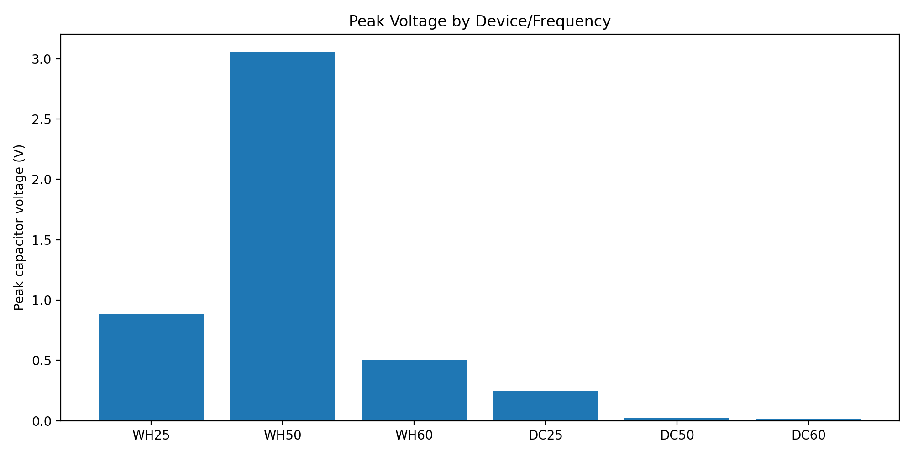

# Ayodeji Sunday Babalola  
## Hardware, Systems & Test Engineering Portfolio

Hardware engineer focused on **experimental validation, embedded systems, optical sensing, and energy harvesting R&D**, with strong emphasis on:

- measurement-driven debugging  
- hardware characterization  
- system-level reliability  
- sensor system validation  
- experimental prototyping  

This repository presents representative engineering projects demonstrating how I approach **real hardware problems** — designing experiments, collecting measurements, isolating root causes, and iterating hardware and firmware together.

Some projects are documented at the **system architecture and validation methodology level** due to NDAs.

---

# Featured Engineering Work

## Laser Triangulation Sensor Validation

Experimental validation of a **laser triangulation optical sensing system** used for displacement measurement.

The work includes:

- optical alignment and calibration  
- sensor accuracy and repeatability characterization  
- signal linearity analysis  
- noise characterization  
- calibration curve generation  
- experimental validation setup design  

Project documentation:

[Laser Triangulation Sensor Validation](08_laser_triangulation_sensor_validation/)

Presentation overview:

[Laser Triangulation Sensor Development & Validation](08_laser_triangulation_sensor_validation/laser_triangulation_overview.pdf)

---

## Vibration Energy Harvesting Experiments

Experimental characterization of **broadband and piezoelectric vibration energy harvesting systems** using controlled shaker excitation.

Two harvesting approaches were evaluated:

- **WaveHarvester broadband energy harvester**
- **Double-cantilever piezoelectric harvesters**

### Example Experimental Result

| Architecture | Frequency | Test Duration | Peak Voltage |
|---|---|---|---|
| WaveHarvester | 50 Hz | 6 min | ~3.05 V |
| Double Cantilever | 25 Hz | 6 min | ~0.247 V |
| Double Cantilever | 50 Hz | 6 min | ~0.022 V |

These results demonstrate the performance difference between **broadband harvesting architectures** and **narrowband resonant harvesters**.



Full experiment documentation:

[2026-03-05 Vibration Harvester Validation](docs/field-notes/2026-03-05-vibration-harvester-validation)

Prototype development work:

[Energy Harvesting Prototyping](04_energy_harvesting_prototyping/)

---

## Hardware Debug & Root Cause Isolation

Representative debugging case studies demonstrating structured engineering approaches to diagnosing hardware failures.

Example problem domains include:

- power rail failures  
- PCB assembly defects  
- signal integrity issues  
- board bring-up failures  
- measurement-driven fault isolation  

Case study examples:

[Hardware Debug Case Studies](07_hardware_debug_case_studies/)

---

# Embedded Telemetry Firmware

Energy harvesting experiments use an **ESP32-based telemetry system** for measurement logging and remote monitoring.

Capabilities include:

- ADC voltage sampling  
- CSV telemetry logging  
- optional ThingsBoard telemetry streaming  
- Wi-Fi failover  
- watchdog recovery for long-duration experiments  

Firmware location:
firmware/esp32-waveharvester/


---

# Core Engineering Expertise

- Post-silicon validation and characterization  
- Electronics bring-up and PCB fault isolation  
- Firmware and low-level interface testing  
- Optical sensing system validation  
- Experimental hardware prototyping  
- Energy harvesting systems and sensor platforms  
- Test process design and validation strategy  
- Python-based test automation  
- Data-driven engineering and measurement analysis  
- Cross-functional systems engineering  

---

# Project Index

| Section | Project |
|------|------|
| 01 | [Post-Silicon Validation of MEMS Timing Devices](01_post_silicon_validation/) |
| 02 | [Electronics & PCB Validation for Embedded Systems](02_electronics_pcb_validation/) |
| 03 | [Firmware & Low-Level Software Testing](03_firmware_low_level_testing/) |
| 04 | [Energy Harvesting & Sensor Systems Prototyping](04_energy_harvesting_prototyping/) |
| 05 | [Test Process Design & Validation Strategy](05_test_process_design/) |
| 06 | [Cross-Functional Systems Engineering & Delivery](06_cross_functional_engineering/) |
| 07 | [Hardware Debug Case Studies](07_hardware_debug_case_studies/) |
| 08 | [Laser Triangulation Sensor Validation](08_laser_triangulation_sensor_validation/) |

---

# Repository Structure
```
technical-portfolio-hardware-systems/
│
├── 01_post_silicon_validation
├── 02_electronics_pcb_validation
├── 03_firmware_low_level_testing
├── 04_energy_harvesting_prototyping
├── 05_test_process_design
├── 06_cross_functional_engineering
├── 07_hardware_debug_case_studies
├── 08_laser_triangulation_sensor_validation
│
├── docs
│ └── field-notes
│
├── firmware
│ └── esp32-waveharvester
│
└── README.md
```


Projects typically include:

- system architecture documentation  
- debugging methodology  
- experimental setup design  
- measurement instrumentation  
- test results and observations  
- engineering conclusions  

---

# Engineering Approach

My work emphasizes **measurement-driven engineering**.

Rather than relying purely on theoretical models, I prioritize:

- designing controlled experiments  
- instrumenting systems to capture real electrical and mechanical behavior  
- analyzing measurement data  
- isolating root causes through structured debugging  
- iterating both hardware and firmware designs  

The documentation in this repository is structured similarly to **internal validation reports used in hardware R&D environments.**

---

# Contact

I am happy to walk through any of these projects during **technical interviews or engineering discussions**.

LinkedIn  
https://linkedin.com/in/ayodejibabalola  

GitHub  
https://github.com/AyodejiBaba